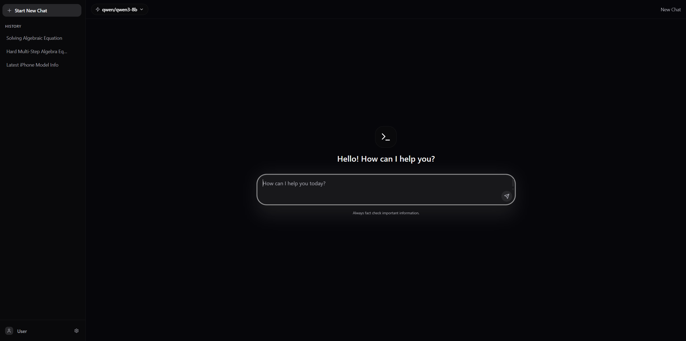
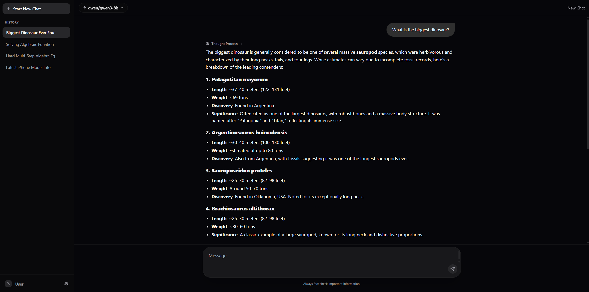

# Serenity Chat (UI)

This project aims to make a very aestetically pleasing front end UI, **fully opened sourced** for anyone to edit, refurbish, sell, for users using an openai-compatable API. Also this project has been **heavily vibe-coded**, as I've been wanting to use my local AI experts.



## ✨ Key Features
- **100% Offline Support**: No reliance on Google Fonts, external CDN files, or remote APIs (besides your self-hosted LLM).

- **Local LLM Integration**: Seamlessly connects to models running on LM Studio via a local API endpoint.

- **Real-time History**: All chat sessions and history are stored locally in the browser's localStorage.

- **Theming**: Multiple light and dark themes (Dark, Light, Ect.).

- **Advanced UI**: Smooth animations powered by Framer Motion, syntax highlighting for code blocks, and KaTeX support for math/LaTeX rendering.

- **And much more!**



## Building from Source

As of now, I'm not entirely sure how to use docker image, so for now you're going to have to build from source.

### Step 1: LM-Studio
You must start a LM-Studio server.

1. [**Download and Install LM-Studio**](https://lmstudio.ai/)
2. **Download a Model**: you can download any model from their page or inside the app UI.
3. **Start the Local Server**:
    - Navigate to the Local Server tab (the icon that looks like >_ ).
    - Select the model you downloaded from the dropdown menu.
    - Ensure the Server Port is set to 1234 (this is the default used by the app).
    - Click Start Server.
The server endpoint should be http://localhost:1234/v1. This is where the chat app will send requests.

### Step 2: Frontend
This project requires Node.js (version 18+) and npm
1. Clone the Repo:
    ```
    git clone https://github.com/Smoffyy/serenity-chat
    ```

2. **Install Dependencies**:
    ```
    npm install
    ```

3. **Run Development Server**:
    ```
    npm run dev
    ```

4. **Access the App**: Open your browser and navigate to:
    ```
    http://localhost:3000
    ```